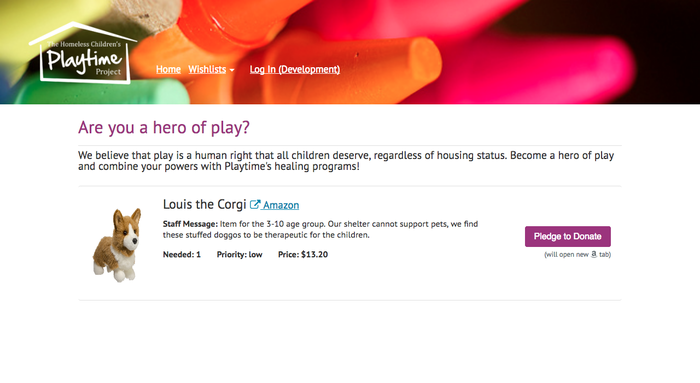

[][HCPP]

# Homeless Children's Playtime Project
[](https://travis-ci.org/rubyforgood/playtime)

*The mission of the [Homeless Children's Playtime Project][HCPP] is to nurture
healthy child development and reduce the effects of trauma among children
living in temporary housing programs in Washington, DC.*

*Playtime seeks to create a city that provides every opportunity for children
in families experiencing homelessness to succeed by ensuring consistent
opportunities to play and learn, offering support services for families, and
advocating for affordable housing and safe shelter.*

[HCPP]: http://www.playtimeproject.org/

### About This App

The goal of this application is to allow supporters to donate toys and other
items that help advance the work of Playtime Project's work in family shelters
throughout DC. This application will allow donors to view the organization's
Amazon wish lists, add items, track contributions, and aid staff in following
up with donors.



### About Ruby for Good

This project was born at Ruby for Good 2017.

Ruby for Good is an annual event based out of the DC-metro area where Ruby
programmers from all over the globe get together for a long weekend to build
projects that help our communities. For more information about Ruby for Good,
[visit the website] or [check out the other projects].

[visit the website]: http://rubyforgood.org/
[check out the other projects]: http://rubyforgood.org/yearbook.html


## Join the Team

This application is a work in progress, and we encourage you to jump in!

To get started, follow our [Getting Started](#getting-started) guide to set up
your computer, then check out [our GitHub Issues][issues] to see what issues are
currently in the pipeline. You can find our contribution guidelines in
[CONTRIBUTING]. Get in touch with [@micahbales] for more details.

To join the conversation, join the [#playtime][slack-channel] channel
on Slack ([get an invite][slack-invite]).

* [Getting Started](#getting-started)
    * [Quick Start](#quick-start)
    * [Getting Amazon OAuth Working Locally](#getting-amazon-oauth-working-locally)
    * [Getting Amazon Product Advertising API Working Locally](#getting-amazon-product-advertising-api-working-locally)
* [Testing](#testing)
* [Environment](#environment)

[issues]: https://github.com/rubyforgood/playtime/issues
[@micahbales]: https://github.com/micahbales
[slack-channel]: https://rubyforgood.slack.com/messages/playtime
[slack-invite]: https://rubyforgood.herokuapp.com/
[CONTRIBUTING]: .github/CONTRIBUTING.md

### Getting Started

#### Quick Start

By the end of this section, you should have the project and dependencies
installed on your local system. For information on how to contribute, see
[Contributing][CONTRIBUTING].

You need:

  - Ruby 2.4.1
  - Rails 5.1
  - Postgres >=9.1
  - A JavaScript runtime, we recommend Node.js

You will need Node.js (which comes bundled with NPM) and it is easiest to
install on Mac, Windows, or Linux [with your favorite package manager][node-pkg]
or by downloading directly from [nodejs.org][node-direct].

[node-pkg]:    https://nodejs.org/en/download/package-manager/
[node-direct]: https://nodejs.org/en/download/

You will also need Git, Ruby, Rails, and PostgreSQL. If you have Git and
Postgres in some version or another you're probably set. But:

  - If you're working on **a fresh Windows machine**, you're best off installing
    Ruby and Rails with the [Rails Installer]. For PostgreSQL, you'll want to
    install [EnterpriseDB].

  - If you have **a fresh Mac OS X machine**, just follow these
    [directions][Go Rails] (if you're running a different OS version, switch to
    the correct version). These instructions include PostgreSQL.

  - If you are using **Ubuntu Linux**, use this [Rails Apps Guide] to get set
    up with Ruby, Rails, and Node.js and this guide to
    [install PostgreSQL][Postgres Ubuntu].

  - Otherwise, Google for instructions for your OS of choice. Let us know if
    you get stuck!

[Rails Installer]: http://railsinstaller.org
[EnterpriseDB]: https://www.enterprisedb.com/downloads/postgres-postgresql-downloads#windows

[Go Rails]: https://gorails.com/setup/osx

[Rails Apps Guide]: http://railsapps.github.io/installrubyonrails-ubuntu.html
[Postgres Ubuntu]: https://www.postgresql.org/download/linux/ubuntu/


Navigate to your desired working directory. Then from a command prompt:

  ```bash
  $ git clone http://github.com/rubyforgood/playtime
  $ cd playtime
  $ bin/setup
  $ rails server
  ```

Then navigate to `http://localhost:3000` in your browser to view the app.

#### Getting Amazon OAuth Working Locally (Optional)

By the end of this section, you should be able to create an account/login to
the app on your local machine.

This application uses Amazon OAuth for authentication. In order to create an
account or login locally:

1. Follow [these instructions][Amazon OAuth Instructions] to create an Amazon
   app. This is required for logging in/creating

2. If you don't have a `.env` file, copy the sample .env configuration:

    ```bash
    # from the root project directory
    $ cp .env.sample .env
    ```

3. In `.env`, fill in the id and secret keys for your Amazon app (Client ID and
   Client Secret on your Amazon App Console):

    ```bash
    # .env
    AMAZON_CLIENT_ID="your client id"
    AMAZON_CLIENT_SECRET="your client secret"
    # ...
    ```

4. *(Optional: Setting up your admin account)* If you want your development
   account to be an admin, you can set that up by setting the admin environment
   variables:

   ```bash
   # .env
   ADMIN_NAME="your name"
   ADMIN_AMAZON_EMAIL="the email you use for your amazon.com account"
   ```

   Next, run `rake users:initialize_admin`. If you've already logged in, your
   account will be promoted to an admin. If you haven't, your new admin account
   will be created.

   You can also change your user role by using `rails console`.

5. Start your Rails app with `rails server`. You're ready to OAuth!

[Amazon OAuth Instructions]: https://github.com/wingrunr21/omniauth-amazon#prereqs


#### Getting Amazon Product Advertising API Working Locally

By the end of this section, you should be able to search Amazon products and
add items to wishlists on your local machine (when your logged-in user is an
admin or site manager).

**This step is only required for site managers and admins searching/adding
Amazon products.** If your issue doesn't involve working with the Amazon
Product API, you'll be fine without this step.

Admins and site managers can add new items to their wishlists by searching
the Amazon Product API. To get this search working locally, you'll need to
create a few Amazon accounts and add some more `.env` configuration:

  1. First, [register for an Amazon Associate account][Amazon Associate]. Order
     matters here; be sure to do this before step #2!

  2. Next, [become a Product Advertising API Developer][Product Advertising API].

  3. Last, using the AWS credentials you downloaded (or viewed) in step #2,
     update your `.env` configuration:

       ```bash
       # .env
       # ...
       AWS_ACCESS_KEY="your access key id goes here"
       AWS_SECRET_KEY="your secret access key goes here"
       AWS_ASSOCIATES_TAG="playtim009-20" # <- same for everyone
       ```
     You'll only be able to download your secret key once, so make sure you put
     it in a safe place! Otherwise, you'll have to log in and regenerate your
     credentials.

Restart the server and you're done–you can search to your heart's content!

[Amazon Associate]: http://docs.aws.amazon.com/AWSECommerceService/latest/DG/becomingAssociate.html
[Product Advertising API]: http://docs.aws.amazon.com/AWSECommerceService/latest/DG/becomingDev.html


### Testing

All specs must pass in order for a PR to be accepted. Specs and associated
checks can be run with

  ```bash
  $ bin/rake
  ```

Specs can be found in the `spec` folder, and they follow the typical `rspec`
directory structure. Some notes:

  - We're using FactoryGirl to generate objects, and those files can be found
    in `spec/factories/<plural_model_name>.rb`.

  - Support files, including helper methods, gem initialization/configuration,
    etc. can be found in `spec/support`.

  - While we use factories instead of fixtures to generate objects, static
    test files (ex. images or API responses) can be found in `fixtures`.

  - External HTTP requests can be mocked with WebMock. To mark a spec as
    containing an external request, use the `:external` tag.


### Environment

We manage environment variables using `.env`. This file should be created when
your run `bin/setup`, but you can always copy `.env.sample` if it gets deleted.
For changes to `.env` to take effect, you'll need to restart your server.

**Remember: `.env` should never be checked into source control!**

  ```bash
  # Annotated .env example

  # The client id and secret are used for OAuth (creating accounts/logging in).
  # Setup instructions can be found above in "Getting Started with OAuth"
  AMAZON_CLIENT_ID="your amazon client id"
  AMAZON_CLIENT_SECRET="your amazon client secret key"

  # The access key and secret are used for interacting with the Amazon Product
  # API. Setup instructions can be found above in "Getting Amazon Product
  # Advertisement API Working Locally"
  AWS_ACCESS_KEY="your aws access key"
  AWS_SECRET_KEY="your aws secret key"

  # If you want to force Amazon login instead of developer in development environment
  # set it to true.
  FORCE_AMAZON_LOGIN=false

  # Code for generating affiliate links from search (same for everyone)
  AWS_ASSOCIATES_TAG="playtim009-20"

  # Default rack env and port (same for everyone)
  RACK_ENV="development"
  PORT=3000

  # Admin account details for `rake users:initialize_admin`
  ADMIN_NAME="your name"
  ADMIN_EMAIL="the email you use for your amazon.com account"
  ```
